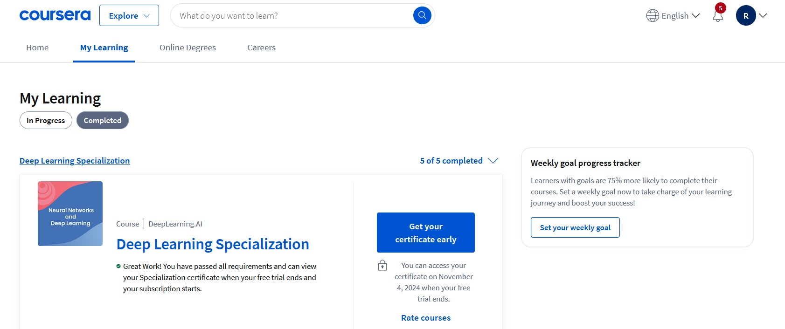

# Deep Learning Specialization on Coursera 

Programming assignments from all courses in the Coursera [Deep Learning specialization](https://www.coursera.org/specializations/deep-learning) offered by `deeplearning.ai`.

Instructor: [Andrew Ng](http://www.andrewng.org/)

## Personal Notes

This specialization is an excellent resource for anyone interested in Deep Learning, from beginners to intermediate practitioners. What makes it particularly valuable:

**Comprehensive Foundation**: Provides a robust theoretical and practical understanding of deep learning fundamentals.

**Expert Insights**: Includes interviews with AI pioneers and industry leaders, such as Geoffrey Hinton (2018 Turing Award winner, 2024 Nobel Prize laureate) and Andrej Karpathy (former AI Director at Tesla), along with other key figures in the field.

**Practical Focus**: The final two courses on CNNs and Sequence Models are particularly valuable, offering hands-on experience with real-world applications, deep insights into modern architectures, and the implementation of state-of-the-art models.

## Programming Assignments

### Course 1: Neural Networks and Deep Learning

- [Week 2 - Logistic Regression with a Neural Network mindset](https://nbviewer.org/github/RaulAdSe/DL-Coursera-Specialization/blob/main/Notebooks/1%20-%20Neural%20Networks%20and%20Deep%20Learning/Week%202%20-%20Neural%20Network%20Basics/Logistic_Regression_with_a_Neural_Network_mindset.ipynb)
- [Week 3 - Planar data classification with one hidden layer](https://nbviewer.org/github/RaulAdSe/DL-Coursera-Specialization/blob/main/Notebooks/1%20-%20Neural%20Networks%20and%20Deep%20Learning/Week%203%20-%20Shallow%20Neural%20Networks/Planar_data_classification_with_one_hidden_layer.ipynb)
- [Week 4 - Building your Deep Neural Network: Step by Step](https://nbviewer.org/github/RaulAdSe/DL-Coursera-Specialization/blob/main/Notebooks/1%20-%20Neural%20Networks%20and%20Deep%20Learning/Week%204%20-%20Deep%20Neural%20Networks/Building_your_Deep_Neural_Network_Step_by_Step.ipynb)
- [Week 4 - Deep Neural Network Application](https://nbviewer.org/github/RaulAdSe/DL-Coursera-Specialization/blob/main/Notebooks/1%20-%20Neural%20Networks%20and%20Deep%20Learning/Week%204%20-%20Deep%20Neural%20Networks/Deep_Neural_Network_Application.ipynb)

### Course 2: Improving Deep Neural Networks: Hyperparameter tuning, Regularization and Optimization

- [Week 1 - Initialization](https://nbviewer.org/github/RaulAdSe/DL-Coursera-Specialization/blob/main/Notebooks/2%20-%20Improving%20Deep%20Neural%20Networks%20Hyperparameter%20Tuning%2C%20Regularization%20and%20Optimization/Week%201%20-%20Practical%20Aspects%20of%20DL/Initialization.ipynb)
- [Week 1 - Regularization](https://nbviewer.org/github/RaulAdSe/DL-Coursera-Specialization/blob/main/Notebooks/2%20-%20Improving%20Deep%20Neural%20Networks%20Hyperparameter%20Tuning%2C%20Regularization%20and%20Optimization/Week%201%20-%20Practical%20Aspects%20of%20DL/Regularization.ipynb)
- [Week 1 - Gradient Checking](https://nbviewer.org/github/RaulAdSe/DL-Coursera-Specialization/blob/main/Notebooks/2%20-%20Improving%20Deep%20Neural%20Networks%20Hyperparameter%20Tuning%2C%20Regularization%20and%20Optimization/Week%201%20-%20Practical%20Aspects%20of%20DL/Gradient_Checking.ipynb)
- [Week 2 - Optimization Methods](https://nbviewer.org/github/RaulAdSe/DL-Coursera-Specialization/blob/main/Notebooks/2%20-%20Improving%20Deep%20Neural%20Networks%20Hyperparameter%20Tuning%2C%20Regularization%20and%20Optimization/Week%202%20-%20Optimization%20Algorithms/Optimization_methods.ipynb)
- [Week 3 - TensorFlow Tutorial](https://nbviewer.org/github/RaulAdSe/DL-Coursera-Specialization/blob/main/Notebooks/2%20-%20Improving%20Deep%20Neural%20Networks%20Hyperparameter%20Tuning%2C%20Regularization%20and%20Optimization/Week%203%20-%20Hyperparameter%20Tuning%2C%20Batch%20Normalization%2C%20Programming%20Frameworks/Tensorflow_introduction.ipynb)

### Course 4: Convolutional Neural Networks

- [Week 1 - Convolutional Model: step by step](https://nbviewer.org/github/RaulAdSe/DL-Coursera-Specialization/blob/main/Notebooks/4%20-%20Convolutional%20Neural%20Networks/Week%201%20-%20Foundations%20of%20CNNs/Convolution_model_Step_by_Step_v1.ipynb)
- [Week 1 - Convolutional Neural Networks: Application](https://nbviewer.org/github/RaulAdSe/DL-Coursera-Specialization/blob/main/Notebooks/4%20-%20Convolutional%20Neural%20Networks/Week%201%20-%20Foundations%20of%20CNNs/Convolution_model_Application.ipynb)
- [Week 2 - Transfer Learning with MobileNet](https://nbviewer.org/github/RaulAdSe/DL-Coursera-Specialization/blob/main/Notebooks/4%20-%20Convolutional%20Neural%20Networks/Week%202%20-%20DCNNs%20Case%20Studies/Transfer_learning_with_MobileNet_v1.ipynb)
- [Week 2 - Residual Networks](https://nbviewer.org/github/RaulAdSe/DL-Coursera-Specialization/blob/main/Notebooks/4%20-%20Convolutional%20Neural%20Networks/Week%202%20-%20DCNNs%20Case%20Studies/Residual_Networks.ipynb)
- [Week 3 - Car detection with YOLO](https://nbviewer.org/github/RaulAdSe/DL-Coursera-Specialization/blob/main/Notebooks/4%20-%20Convolutional%20Neural%20Networks/Week%203%20-%20Object%20Detection/Autonomous_driving_application_Car_detection.ipynb)
- [Week 4 - Art Generation with Neural Style Transfer](https://nbviewer.org/github/RaulAdSe/DL-Coursera-Specialization/blob/main/Notebooks/4%20-%20Convolutional%20Neural%20Networks/Week%204%20-%20Special%20Applications/Neural_Style_Transfer/Art_Generation_with_Neural_Style_Transfer.ipynb)
- [Week 4 - Face Recognition](https://nbviewer.org/github/RaulAdSe/DL-Coursera-Specialization/blob/main/Notebooks/4%20-%20Convolutional%20Neural%20Networks/Week%204%20-%20Special%20Applications/Face_Recognition/Face_Recognition.ipynb)

### Course 5: Sequence Models

- [Week 1 - Building a Recurrent Neural Network - Step by Step](https://nbviewer.org/github/RaulAdSe/DL-Coursera-Specialization/blob/main/Notebooks/5%20-%20Sequence%20Models/Week%201%20-%20RNNs/Building_a_Recurrent_Neural_Network_Step_by_Step.ipynb)
- [Week 1 - Character-level Language Modeling](https://nbviewer.org/github/RaulAdSe/DL-Coursera-Specialization/blob/main/Notebooks/5%20-%20Sequence%20Models/Week%201%20-%20RNNs/Dinosaurus_Island_Character_level_language_model.ipynb)
- [Week 2 - Word Vector Representation](https://nbviewer.org/github/RaulAdSe/DL-Coursera-Specialization/blob/main/Notebooks/5%20-%20Sequence%20Models/Week%202%20-%20NLP%20and%20Word%20Embeddings/Operations_on_word_vectors.ipynb)
- [Week 3 - Neural Machine Translation with Attention](https://nbviewer.org/github/RaulAdSe/DL-Coursera-Specialization/blob/main/Notebooks/5%20-%20Sequence%20Models/Week%203%20-%20Sequence%20Models%20and%20Attention%20Mechanism/Neural_machine_translation_with_attention.ipynb)
- [Week 4 - Transformer Network](https://nbviewer.org/github/RaulAdSe/DL-Coursera-Specialization/blob/main/Notebooks/5%20-%20Sequence%20Models/Week%204%20-%20Transformers/Transformer_architecture_v1.ipynb)
- 
## About this Specialization

This five-course specialization helps you understand the fundamentals of Deep Learning, apply them in various applications, and build a career in AI. You'll learn:

- Building and training deep neural networks
- Implementing vectorized neural networks
- Identifying key architecture parameters
- Implementing optimization algorithms
- Building convolutional neural networks
- Implementing neural transfer learning
- Applying sequence models
- Working with natural language processing systems

## Credits

This repo contains my work for this specialization. The code base and diagrams are taken from the [Deep Learning Specialization on Coursera](https://www.coursera.org/specializations/deep-learning), unless specified otherwise.

## Disclaimer

The solutions in this repository are for reference only. Please attempt the assignments yourself before consulting these solutions.
